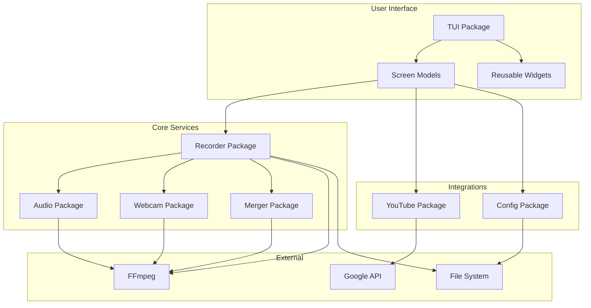
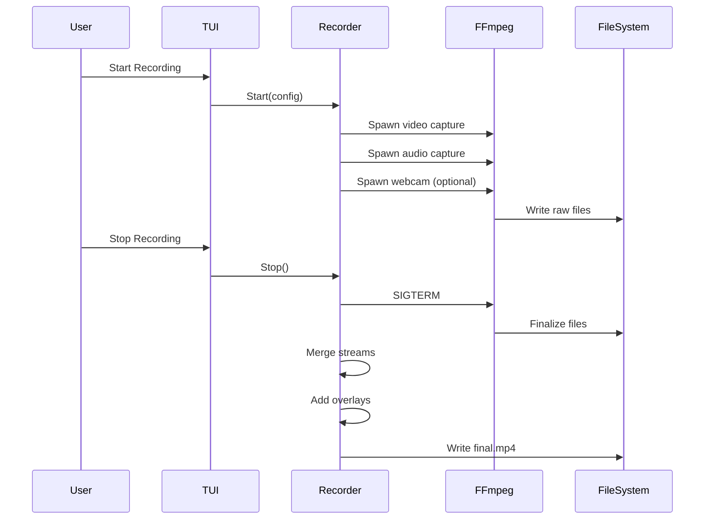

# Architecture

This document describes the high-level architecture of Kartoza Screencaster, including system design, component interactions, and data flow.

## System Overview



## Architecture Principles

### 1. Separation of Concerns

Each package has a single, well-defined responsibility:

| Package | Responsibility |
|---------|----------------|
| `tui` | User interface and navigation |
| `recorder` | Recording orchestration |
| `audio` | Audio capture and processing |
| `webcam` | Webcam capture |
| `merger` | Video post-processing |
| `youtube` | YouTube API integration |
| `config` | Configuration persistence |

### 2. Message-Driven UI

The TUI follows the Elm Architecture (Model-View-Update):

```go
type Model interface {
    Init() tea.Cmd       // Initialize state
    Update(msg) Cmd      // Handle messages
    View() string        // Render to string
}
```

### 3. Process Isolation

Recording processes run as separate FFmpeg subprocesses:

- **Benefits:** Crash isolation, resource management
- **Communication:** PID files, signals, file watching

### 4. Configuration as Code

All settings stored in JSON, loaded at startup:

```go
type Config struct {
    Topics           []Topic
    DefaultPresenter string
    LogoDirectory    string
    YouTube          YouTubeConfig
}
```

## Component Architecture

### TUI Layer

```
internal/tui/
├── app.go            # Main application coordinator
├── menu.go           # Main menu screen
├── recording_setup.go # Recording configuration
├── countdown.go      # Pre-recording countdown
├── recording.go      # Active recording display
├── processing.go     # Post-processing progress
├── history.go        # Recording library
├── options.go        # Settings screen
├── youtube_setup.go  # YouTube configuration
├── youtube_upload.go # Upload interface
├── widgets.go        # Reusable UI components
├── splash.go         # Application splash screen
└── styles.go         # Consistent styling
```

**Key Design Decisions:**

1. **Screen-based navigation** - Each screen is a separate model
2. **Centralized state** - AppModel coordinates screens
3. **Consistent styling** - Shared style definitions
4. **Reusable widgets** - Common UI patterns extracted

### Recording Pipeline



### Data Flow

#### Configuration Loading

```
~/.config/kartoza-screencaster/config.json
    ↓
config.Load()
    ↓
Config struct
    ↓
Distributed to screens as needed
```

#### Recording Output

```
Recording Start
    ↓
~/Videos/Screencasts/<topic>/<title>/
    ├── video.mkv (raw screen)
    ├── audio.wav (raw audio)
    ├── webcam.mkv (raw webcam)
    ↓
Post-processing
    ↓
    ├── final.mp4
    ├── final_vertical.mp4 (optional)
    └── metadata.json
```

## State Management

### Application States

```go
type appState int

const (
    stateMenu appState = iota
    stateRecordingSetup
    stateCountdown
    stateRecording
    stateProcessing
    stateHistory
    stateOptions
    stateYouTubeSetup
    stateYouTubeUpload
)
```

### Recording States

```go
type RecordingStatus struct {
    IsRecording bool
    IsPaused    bool
    Duration    time.Duration
    VideoFile   string
    AudioFile   string
    WebcamFile  string
}
```

### Processing States

```go
type StepStatus int

const (
    StepPending StepStatus = iota
    StepRunning
    StepComplete
    StepSkipped
    StepFailed
)
```

## Error Handling

### Strategy

1. **User-facing errors** - Displayed in UI with recovery options
2. **Internal errors** - Logged, graceful degradation
3. **Critical errors** - Application exit with message

### Error Flow

```go
// Package returns error
err := recorder.Start(config)
if err != nil {
    // TUI displays error message
    m.err = err
    m.state = stateError
    return m, nil
}
```

## Concurrency Model

### Goroutines Used For

1. **Audio beeps** - Non-blocking countdown sounds
2. **Progress updates** - FFmpeg progress monitoring
3. **File watching** - Status file changes
4. **YouTube upload** - Background upload with progress

### Synchronization

- **Channels** for progress updates
- **Mutexes** for shared state (minimal)
- **Context** for cancellation

## Platform Abstraction

### Build Tags

```go
// audio_linux.go
//go:build linux

// audio_darwin.go
//go:build darwin

// audio_windows.go
//go:build windows
```

### Platform-Specific Code

| Component | Linux | macOS | Windows |
|-----------|-------|-------|---------|
| Screen capture | wlr-randr/xrandr | screencapture | dxgi |
| Audio | PipeWire/Pulse/ALSA | CoreAudio | WASAPI |
| Webcam | v4l2 | AVFoundation | DirectShow |

## Extension Points

### Adding New Screens

1. Create new model in `internal/tui/`
2. Implement `tea.Model` interface
3. Add to `AppModel` and navigation

### Adding New Processing Steps

1. Add step to `ProcessingState`
2. Implement processing logic in `Merger`
3. Update progress reporting

### Adding New Integrations

1. Create new package in `internal/`
2. Define clean interface
3. Integrate with TUI screens

## Performance Considerations

### Memory Usage

- **Streaming processing** - No full video in memory
- **Progress channels** - Bounded buffers
- **UI rendering** - Only visible content

### CPU Usage

- **FFmpeg handles heavy lifting** - Dedicated processes
- **TUI is lightweight** - Simple string rendering
- **Minimal background work** - Efficient polling

### Disk I/O

- **Sequential writes** - Optimal for HDD/SSD
- **Temporary files** - Cleaned up after processing
- **Configurable output location** - User choice

## Security Considerations

### Credential Storage

- OAuth tokens stored in config file
- File permissions: `0600` (user read/write only)
- No plaintext passwords

### Process Isolation

- FFmpeg runs as separate process
- No elevated privileges required
- Sandboxed where possible

### Input Validation

- File paths sanitized
- User input length limited
- No shell injection vectors
