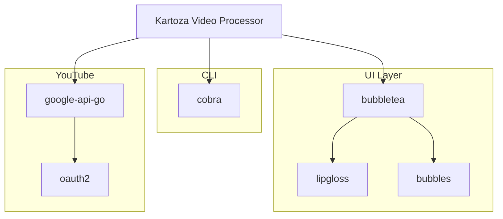

# Libraries

This document describes the third-party libraries used in Kartoza Video Processor and the rationale for their selection.

## Core Libraries

### Bubble Tea

<div class="feature-card" markdown>
**[github.com/charmbracelet/bubbletea](https://github.com/charmbracelet/bubbletea)**

The Elm Architecture for terminal applications.
</div>

**Version:** v1.3.10

**Purpose:** Foundation for the entire TUI

**Why chosen:**

- Elm Architecture provides predictable state management
- Excellent performance and low memory usage
- Active development and community
- Works well with other Charm libraries

**Usage:**

```go
type Model interface {
    Init() tea.Cmd
    Update(tea.Msg) (tea.Model, tea.Cmd)
    View() string
}
```

---

### Lip Gloss

<div class="feature-card" markdown>
**[github.com/charmbracelet/lipgloss](https://github.com/charmbracelet/lipgloss)**

Style definitions for terminal UIs.
</div>

**Version:** v1.1.1

**Purpose:** Consistent styling and layout

**Why chosen:**

- Declarative styling API
- Flexbox-like layout
- Color support with degradation
- Integrates seamlessly with Bubble Tea

**Usage:**

```go
style := lipgloss.NewStyle().
    Bold(true).
    Foreground(lipgloss.Color("#FF9500")).
    Padding(1, 2)

rendered := style.Render("Hello, World!")
```

---

### Bubbles

<div class="feature-card" markdown>
**[github.com/charmbracelet/bubbles](https://github.com/charmbracelet/bubbles)**

Common UI components for Bubble Tea.
</div>

**Version:** v0.21.1

**Purpose:** Reusable UI widgets

**Components used:**

| Component | Usage |
|-----------|-------|
| `textinput` | Title, description inputs |
| `textarea` | Multi-line description |
| `spinner` | Loading indicators |
| `progress` | Upload/processing bars |
| `key` | Keyboard handling |
| `table` | Recording history |

---

## YouTube Integration

### Google APIs

<div class="feature-card" markdown>
**[google.golang.org/api](https://pkg.go.dev/google.golang.org/api)**

Official Google API client libraries.
</div>

**Packages used:**

- `youtube/v3` - YouTube Data API
- `oauth2` - Authentication

**Purpose:** YouTube upload and playlist management

**Usage:**

```go
import "google.golang.org/api/youtube/v3"

service, err := youtube.NewService(ctx, option.WithHTTPClient(client))
call := service.Videos.Insert([]string{"snippet", "status"}, video)
response, err := call.Media(file).Do()
```

---

### OAuth2

<div class="feature-card" markdown>
**[golang.org/x/oauth2](https://pkg.go.dev/golang.org/x/oauth2)**

OAuth 2.0 client implementation.
</div>

**Purpose:** Google authentication

**Features used:**

- Authorization code flow
- Token refresh
- Secure token storage

---

## CLI Framework

### Cobra

<div class="feature-card" markdown>
**[github.com/spf13/cobra](https://github.com/spf13/cobra)**

CLI application framework.
</div>

**Version:** v1.10.2

**Purpose:** Command-line argument parsing

**Why chosen:**

- Industry standard for Go CLIs
- Automatic help generation
- Subcommand support
- Shell completion

**Usage:**

```go
var rootCmd = &cobra.Command{
    Use:   "kvp",
    Short: "Kartoza Video Processor",
    Run:   runApp,
}
```

---

## Testing

### Testify (Development)

<div class="feature-card" markdown>
**[github.com/stretchr/testify](https://github.com/stretchr/testify)**

Testing toolkit with assertions.
</div>

**Purpose:** Enhanced test assertions

**Components:**

- `assert` - Test assertions
- `require` - Fatal assertions
- `mock` - Mocking support

---

## Dependency Graph



## Version Management

### go.mod

All dependencies are managed through Go modules:

```go
module github.com/kartoza/kartoza-video-processor

go 1.21

require (
    github.com/charmbracelet/bubbletea v1.3.10
    github.com/charmbracelet/bubbles v0.21.1
    github.com/charmbracelet/lipgloss v1.1.1
    github.com/spf13/cobra v1.10.2
    google.golang.org/api v0.xxx.0
    golang.org/x/oauth2 v0.xxx.0
)
```

### Updating Dependencies

```bash
# Update all
go get -u ./...

# Update specific library
go get -u github.com/charmbracelet/bubbletea

# Check for updates
go list -m -u all
```

## Selection Criteria

When choosing libraries, we consider:

1. **Maintenance** - Active development, responsive maintainers
2. **Community** - Usage, documentation, examples
3. **Performance** - Memory usage, CPU efficiency
4. **API stability** - Semantic versioning, deprecation policy
5. **License** - MIT, Apache 2.0, or similar permissive license
6. **Size** - Minimal dependencies, reasonable binary size

## Alternatives Considered

### TUI Framework

| Library | Consideration | Decision |
|---------|---------------|----------|
| **Bubble Tea** | Elm architecture, excellent ecosystem | **Selected** |
| tview | More traditional, harder to test | Not selected |
| termui | Good for dashboards, less flexible | Not selected |
| tcell | Lower level, more boilerplate | Not selected |

### CLI Framework

| Library | Consideration | Decision |
|---------|---------------|----------|
| **Cobra** | Industry standard, full featured | **Selected** |
| urfave/cli | Good but less ecosystem | Not selected |
| kong | Nice API but newer | Not selected |

## License Summary

| Library | License |
|---------|---------|
| bubbletea | MIT |
| lipgloss | MIT |
| bubbles | MIT |
| cobra | Apache 2.0 |
| google-api-go | BSD-3-Clause |
| oauth2 | BSD-3-Clause |

All dependencies use permissive open-source licenses compatible with the project's MIT license.
