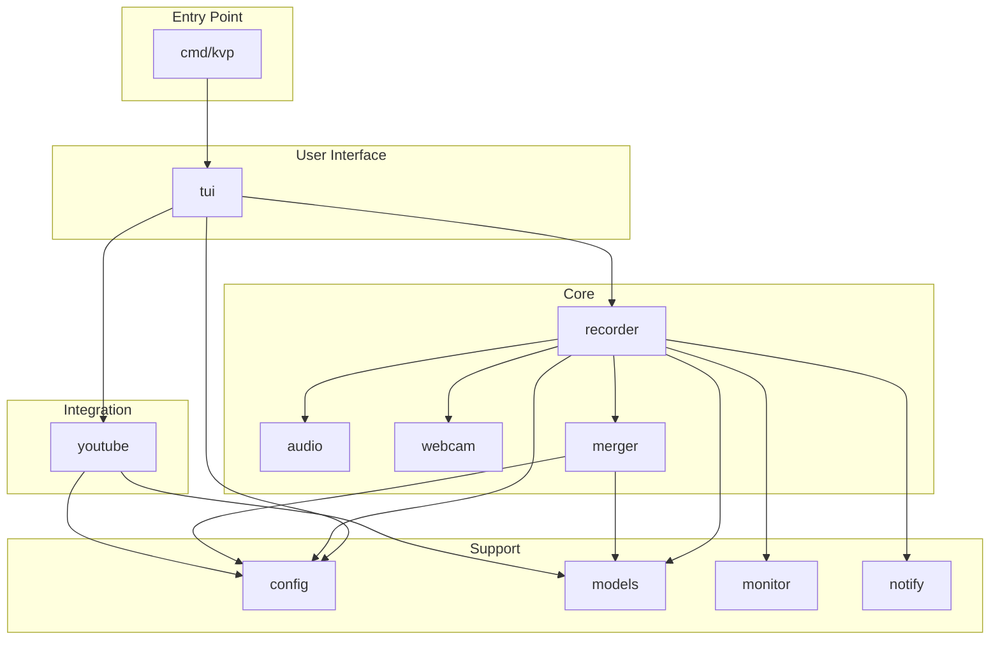

# Module Overview

Kartoza Video Processor is organized into several internal packages, each with a specific responsibility. This section provides detailed documentation for each module.

## Package Structure

```
internal/
├── audio/      # Audio capture and processing
├── config/     # Configuration management
├── merger/     # Video post-processing
├── models/     # Shared data structures
├── monitor/    # Display detection
├── notify/     # Desktop notifications
├── recorder/   # Recording orchestration
├── tui/        # Terminal user interface
├── webcam/     # Webcam capture
└── youtube/    # YouTube API integration
```

## Module Relationships



## Module Summary

| Module | Lines | Purpose | Dependencies |
|--------|-------|---------|--------------|
| **[tui](tui.md)** | ~4000 | User interface | recorder, config, youtube |
| **[recorder](recorder.md)** | ~800 | Recording orchestration | audio, webcam, merger, monitor |
| **[merger](merger.md)** | ~600 | Post-processing | config, models |
| **[youtube](youtube.md)** | ~500 | YouTube upload | config, models |
| **[audio](audio.md)** | ~400 | Audio capture | config |
| **[webcam](webcam.md)** | ~300 | Webcam capture | config |
| **[config](config.md)** | ~300 | Configuration | models |
| **models** | ~200 | Data structures | - |
| **monitor** | ~150 | Display detection | - |
| **notify** | ~100 | Notifications | - |

## Dependency Rules

1. **No circular dependencies** - Packages form a directed acyclic graph
2. **models is shared** - Common data structures available everywhere
3. **config is widely used** - Configuration needed by most packages
4. **tui is the coordinator** - Only TUI imports all other packages

## Package Conventions

### File Naming

```
package_name.go       # Main implementation
package_name_test.go  # Tests
package_name_linux.go # Platform-specific (build tags)
```

### Interface Definition

Each package defines clear interfaces:

```go
// In recorder package
type Recorder interface {
    Start(config RecordingConfig) error
    Stop() error
    Pause() error
    Resume() error
    GetStatus() RecordingStatus
}
```

### Error Handling

Packages return wrapped errors with context:

```go
return fmt.Errorf("failed to start recording: %w", err)
```

## Testing Strategy

| Package | Test Type | Coverage Target |
|---------|-----------|-----------------|
| models | Unit | 90%+ |
| config | Unit | 80%+ |
| recorder | Integration | 70%+ |
| merger | Integration | 70%+ |
| tui | Manual | - |

## Quick Navigation

- **[TUI Package](tui.md)** - User interface implementation
- **[Recorder Package](recorder.md)** - Recording coordination
- **[Audio Package](audio.md)** - Audio capture
- **[Webcam Package](webcam.md)** - Webcam capture
- **[Merger Package](merger.md)** - Post-processing
- **[YouTube Package](youtube.md)** - YouTube integration
- **[Config Package](config.md)** - Configuration management
