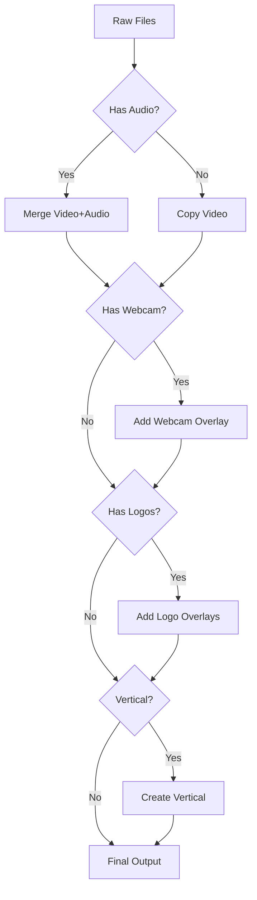

# Merger Package

The `merger` package handles video post-processing, combining multiple streams and applying overlays.

## Package Location

```
internal/merger/
```

## Responsibility

- Merge video and audio streams
- Add logo overlays
- Create vertical video versions
- Apply title text overlays

## Key Files

| File | Purpose |
|------|---------|
| `merger.go` | Core merging and processing logic |

## Key Types

### MergeOptions

Configuration for post-processing:

```go
type MergeOptions struct {
    VideoFile     string
    AudioFile     string
    WebcamFile    string
    OutputFile    string
    AddLogos      bool
    LeftLogo      string
    RightLogo     string
    BottomLogo    string
    Title         string
    TitleColor    string
    GifLoopMode   config.GifLoopMode
    VerticalVideo bool
}
```

### ProgressCallback

Report progress to UI:

```go
type ProgressCallback func(step int, progress float64, message string)
```

## Core Functions

### MergeStreams

Combine video and audio:

```go
func MergeStreams(videoFile, audioFile, outputFile string) error
```

### AddWebcamOverlay

Composite webcam over video:

```go
func AddWebcamOverlay(videoFile, webcamFile, outputFile string) error
```

### AddLogoOverlays

Add logo images to video:

```go
func AddLogoOverlays(inputFile string, opts *MergeOptions, outputFile string) error
```

### CreateVerticalVideo

Convert to 9:16 aspect ratio:

```go
func CreateVerticalVideo(inputFile, outputFile string) error
```

## FFmpeg Commands

### Stream Merge

```bash
ffmpeg -i video.mkv -i audio.wav \
    -c:v libx264 -crf 23 \
    -c:a aac -b:a 192k \
    -map 0:v:0 -map 1:a:0 \
    merged.mp4
```

### Webcam Overlay

```bash
ffmpeg -i main.mp4 -i webcam.mkv \
    -filter_complex "[1:v]scale=320:-1[pip];[0:v][pip]overlay=W-w-20:H-h-20" \
    -c:a copy \
    output.mp4
```

### Logo Overlay

```bash
ffmpeg -i input.mp4 -i logo.png \
    -filter_complex "[1:v]scale=100:-1[logo];[0:v][logo]overlay=20:20" \
    output.mp4
```

### Multiple Logos

```bash
ffmpeg -i input.mp4 \
    -i left_logo.png -i right_logo.png -i bottom_logo.png \
    -filter_complex "\
        [1:v]scale=80:-1[left];\
        [2:v]scale=80:-1[right];\
        [3:v]scale=120:-1[bottom];\
        [0:v][left]overlay=20:20[v1];\
        [v1][right]overlay=W-w-20:20[v2];\
        [v2][bottom]overlay=(W-w)/2:H-h-20" \
    output.mp4
```

### Animated GIF Logo

```bash
# Continuous loop
ffmpeg -i input.mp4 -ignore_loop 0 -i logo.gif \
    -filter_complex "[1:v]scale=100:-1[logo];[0:v][logo]overlay=20:20:shortest=1" \
    output.mp4
```

### Title Text

```bash
ffmpeg -i input.mp4 \
    -vf "drawtext=text='My Title':fontsize=48:fontcolor=white:x=(w-text_w)/2:y=50" \
    output.mp4
```

### Vertical Conversion

```bash
ffmpeg -i input.mp4 \
    -vf "crop=ih*9/16:ih,scale=1080:1920" \
    -c:a copy \
    vertical.mp4
```

## Processing Pipeline



## Logo Positioning

```
┌────────────────────────────────────────┐
│ [Left: 20,20]              [Right: -20,20] │
│                                        │
│                                        │
│            Video Content               │
│                                        │
│                                        │
│         [Bottom: center,-20]           │
└────────────────────────────────────────┘
```

## GIF Loop Modes

| Mode | Behavior |
|------|----------|
| `continuous` | Loop GIF throughout video |
| `once_start` | Play once at beginning |
| `once_end` | Play once at end |

## Error Handling

### File Validation

```go
func MergeStreams(video, audio, output string) error {
    // Check input files exist
    if _, err := os.Stat(video); err != nil {
        return fmt.Errorf("video file not found: %w", err)
    }
    if _, err := os.Stat(audio); err != nil {
        return fmt.Errorf("audio file not found: %w", err)
    }
    // Proceed with merge...
}
```

### FFmpeg Errors

```go
func runFFmpeg(args ...string) error {
    cmd := exec.Command("ffmpeg", args...)
    output, err := cmd.CombinedOutput()
    if err != nil {
        return fmt.Errorf("ffmpeg failed: %s", output)
    }
    return nil
}
```

## Progress Reporting

```go
func MergeWithProgress(opts *MergeOptions, callback ProgressCallback) error {
    callback(1, 0, "Starting merge...")

    // Monitor FFmpeg progress
    // Parse duration and current position
    // Calculate percentage

    callback(1, 100, "Merge complete")
    return nil
}
```

## Usage Example

```go
opts := &merger.MergeOptions{
    VideoFile:   "/tmp/video.mkv",
    AudioFile:   "/tmp/audio.wav",
    OutputFile:  "/tmp/final.mp4",
    AddLogos:    true,
    LeftLogo:    "/path/to/logo.png",
    Title:       "My Video",
    TitleColor:  "#FF9500",
}

err := merger.Process(opts, func(step int, progress float64, msg string) {
    fmt.Printf("Step %d: %.0f%% - %s\n", step, progress, msg)
})
```

## Related Packages

- **recorder** - Produces files for merging
- **config** - Logo settings
