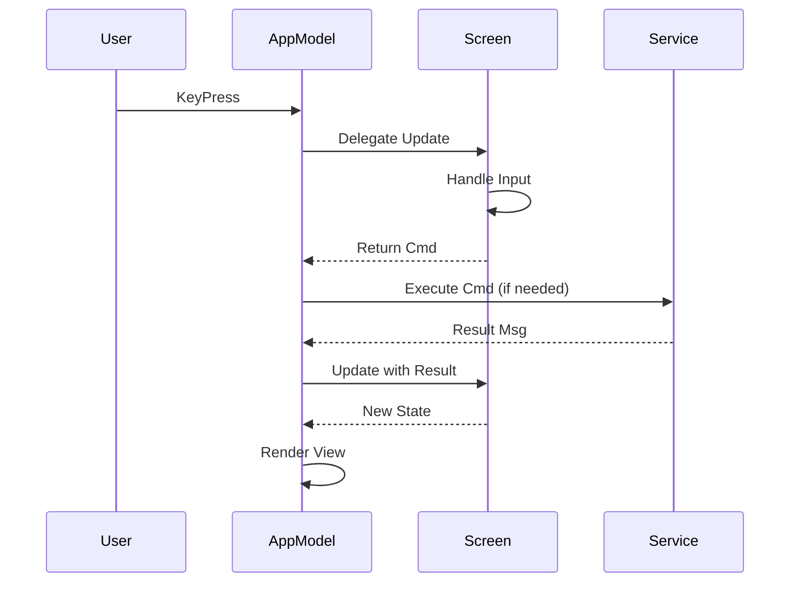

# TUI Package

The `tui` package implements the entire terminal user interface using Bubble Tea and Lip Gloss.

## Package Location

```
internal/tui/
```

## Responsibility

- Screen rendering and navigation
- User input handling
- State management for UI
- Coordination between screens

## Key Files

| File | Purpose |
|------|---------|
| `app.go` | Main application model, screen coordination |
| `menu.go` | Main menu screen |
| `recording_setup.go` | Recording configuration form |
| `countdown.go` | Pre-recording countdown |
| `tui.go` | Legacy recording screen (being refactored) |
| `processing.go` | Post-processing progress display |
| `history.go` | Recording history browser |
| `options.go` | Settings configuration |
| `youtube_setup.go` | YouTube credential setup |
| `youtube_upload.go` | YouTube upload interface |
| `widgets.go` | Reusable UI components |
| `styles.go` | Style definitions |
| `splash.go` | Application splash screen |

## Architecture

### Screen-Based Navigation

```go
type Screen int

const (
    ScreenMenu Screen = iota
    ScreenRecordingSetup
    ScreenRecording
    ScreenHistory
    ScreenOptions
    ScreenYouTubeSetup
    ScreenYouTubeUpload
)
```

### AppModel Structure

```go
type AppModel struct {
    screen          Screen
    menu            *MenuModel
    recordingSetup  *RecordingSetupModel
    options         *OptionsModel
    history         *HistoryModel
    youtubeSetup    *YouTubeSetupModel
    youtubeUpload   *YouTubeUploadModel
    recorder        *recorder.Recorder
    // ... additional state
}
```

## Key Types

### MenuModel

Renders the main menu and handles navigation:

```go
type MenuModel struct {
    selectedItem int
    menuItems    []menuItem
    width        int
    height       int
}
```

### RecordingSetupModel

Manages the recording configuration form:

```go
type RecordingSetupModel struct {
    titleInput    textinput.Model
    numberInput   textinput.Model
    descInput     textarea.Model
    recordAudio   bool
    recordWebcam  bool
    recordScreen  bool
    // ... configuration fields
}
```

### ProcessingState

Tracks post-processing progress:

```go
type ProcessingState struct {
    Steps       []ProcessingStep
    CurrentStep int
}

type ProcessingStep struct {
    Name      string
    Status    StepStatus
    Progress  float64
    StartTime time.Time
    EndTime   time.Time
}
```

## Message Types

### Navigation Messages

```go
type menuActionMsg struct {
    action MenuItem
}

type screenChangeMsg struct {
    screen Screen
}
```

### Recording Messages

```go
type countdownTickMsg struct{}
type statusUpdateMsg models.RecordingStatus
type blinkMsg struct{}
```

### Processing Messages

```go
type processingUpdateMsg struct {
    step     int
    status   StepStatus
    progress float64
}
```

## Styling

### Color Palette

```go
var (
    ColorOrange = lipgloss.Color("#FF9500")
    ColorBlue   = lipgloss.Color("#0066CC")
    ColorGreen  = lipgloss.Color("#00CC66")
    ColorRed    = lipgloss.Color("#FF4444")
    ColorGray   = lipgloss.Color("#666666")
    ColorWhite  = lipgloss.Color("#FFFFFF")
)
```

### Common Styles

```go
var (
    HeaderStyle = lipgloss.NewStyle().
        Bold(true).
        Foreground(ColorOrange)

    ActiveStyle = lipgloss.NewStyle().
        Foreground(ColorOrange).
        Bold(true)
)
```

## Reusable Widgets

### RenderHeader

Creates consistent screen headers:

```go
func RenderHeader(title string) string
```

### RenderHelpFooter

Creates keyboard shortcut hints:

```go
func RenderHelpFooter(text string, width int) string
```

### LayoutWithHeaderFooter

Standard screen layout:

```go
func LayoutWithHeaderFooter(header, content, footer string, width, height int) string
```

## Update Flow



## Testing

Due to the visual nature of TUI, testing is primarily:

1. **Unit tests** for pure functions (formatting, calculations)
2. **Integration tests** for state transitions
3. **Manual testing** for visual verification

```go
func TestMenuNavigation(t *testing.T) {
    m := NewMenuModel()
    m, _ = m.Update(tea.KeyMsg{Type: tea.KeyDown})
    assert.Equal(t, 1, m.selectedItem)
}
```

## Usage Example

```go
package main

import (
    tea "github.com/charmbracelet/bubbletea"
    "github.com/kartoza/kartoza-screencaster/internal/tui"
)

func main() {
    app := tui.NewAppModel()
    p := tea.NewProgram(app, tea.WithAltScreen())
    if _, err := p.Run(); err != nil {
        log.Fatal(err)
    }
}
```

## Related Packages

- **recorder** - Recording functionality
- **config** - Configuration access
- **youtube** - Upload functionality
