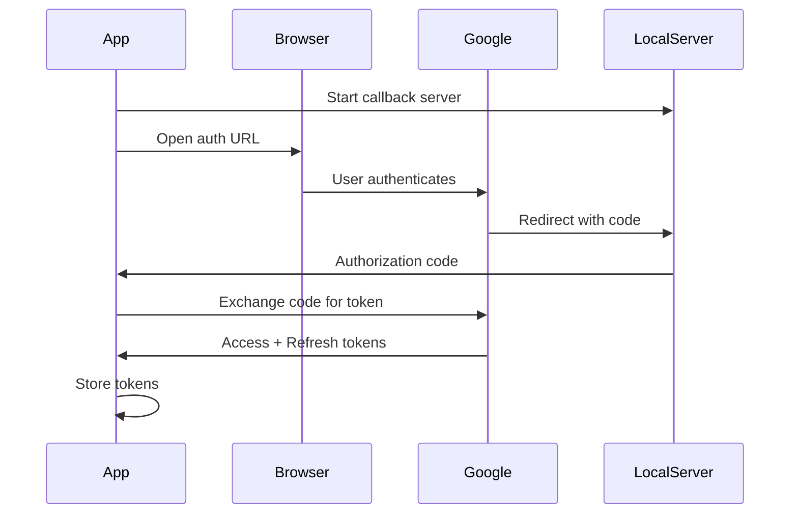

# YouTube Package

The `youtube` package handles YouTube API integration for video uploads and playlist management.

## Package Location

```
internal/youtube/
```

## Responsibility

- OAuth 2.0 authentication with Google
- Video uploads to YouTube
- Playlist management
- Channel information retrieval

## Key Files

| File | Purpose |
|------|---------|
| `auth.go` | OAuth authentication flow |
| `upload.go` | Video upload logic |

## Key Types

### Client

YouTube API client wrapper:

```go
type Client struct {
    service      *youtube.Service
    config       *oauth2.Config
    token        *oauth2.Token
    uploadClient *http.Client
}
```

### UploadOptions

Video upload configuration:

```go
type UploadOptions struct {
    Title       string
    Description string
    Privacy     PrivacyStatus
    PlaylistID  string
    Tags        []string
}
```

### PrivacyStatus

```go
type PrivacyStatus string

const (
    PrivacyPublic   PrivacyStatus = "public"
    PrivacyUnlisted PrivacyStatus = "unlisted"
    PrivacyPrivate  PrivacyStatus = "private"
)
```

### UploadResult

Result of a successful upload:

```go
type UploadResult struct {
    VideoID   string
    URL       string
    Title     string
    Privacy   PrivacyStatus
}
```

### Playlist

YouTube playlist information:

```go
type Playlist struct {
    ID          string
    Title       string
    Description string
    VideoCount  int
}
```

## Authentication

### OAuth Flow



### StartAuth

Begin OAuth authentication:

```go
func (c *Client) StartAuth() (string, error) {
    // Start local server for callback
    // Generate authorization URL
    // Return URL for browser
}
```

### TokenRefresh

Automatically refresh expired tokens:

```go
func (c *Client) refreshToken() error {
    if c.token.Expiry.Before(time.Now()) {
        newToken, err := c.config.TokenSource(ctx, c.token).Token()
        if err != nil {
            return err
        }
        c.token = newToken
        // Save updated token
    }
    return nil
}
```

## Upload Process

### Upload

Upload video to YouTube:

```go
func (c *Client) Upload(filePath string, opts UploadOptions, progress chan<- UploadProgress) (*UploadResult, error)
```

### Resumable Upload

YouTube uses resumable uploads for reliability:

```go
func (c *Client) Upload(...) (*UploadResult, error) {
    // Create video resource
    video := &youtube.Video{
        Snippet: &youtube.VideoSnippet{
            Title:       opts.Title,
            Description: opts.Description,
            Tags:        opts.Tags,
        },
        Status: &youtube.VideoStatus{
            PrivacyStatus: string(opts.Privacy),
        },
    }

    // Start resumable upload
    call := c.service.Videos.Insert([]string{"snippet", "status"}, video)
    call.Media(file, googleapi.ChunkSize(256*1024)) // 256KB chunks

    // Execute with progress
    response, err := call.ProgressUpdater(func(current, total int64) {
        progress <- UploadProgress{Current: current, Total: total}
    }).Do()

    return &UploadResult{VideoID: response.Id}, nil
}
```

### Progress Reporting

```go
type UploadProgress struct {
    Current int64
    Total   int64
    Speed   float64
    ETA     time.Duration
}
```

## Playlist Management

### ListPlaylists

Get user's playlists:

```go
func (c *Client) ListPlaylists() ([]Playlist, error) {
    call := c.service.Playlists.List([]string{"snippet", "contentDetails"}).Mine(true)
    response, err := call.Do()
    // Convert to Playlist structs
}
```

### CreatePlaylist

Create new playlist:

```go
func (c *Client) CreatePlaylist(title, description string, privacy PrivacyStatus) (*Playlist, error) {
    playlist := &youtube.Playlist{
        Snippet: &youtube.PlaylistSnippet{
            Title:       title,
            Description: description,
        },
        Status: &youtube.PlaylistStatus{
            PrivacyStatus: string(privacy),
        },
    }

    response, err := c.service.Playlists.Insert([]string{"snippet", "status"}, playlist).Do()
}
```

### AddToPlaylist

Add video to playlist:

```go
func (c *Client) AddToPlaylist(playlistID, videoID string) error {
    item := &youtube.PlaylistItem{
        Snippet: &youtube.PlaylistItemSnippet{
            PlaylistId: playlistID,
            ResourceId: &youtube.ResourceId{
                Kind:    "youtube#video",
                VideoId: videoID,
            },
        },
    }

    _, err := c.service.PlaylistItems.Insert([]string{"snippet"}, item).Do()
    return err
}
```

## Channel Information

### GetChannelInfo

Get authenticated user's channel:

```go
func (c *Client) GetChannelInfo() (*ChannelInfo, error) {
    call := c.service.Channels.List([]string{"snippet"}).Mine(true)
    response, err := call.Do()

    return &ChannelInfo{
        ID:    response.Items[0].Id,
        Title: response.Items[0].Snippet.Title,
    }, nil
}
```

## Token Storage

Tokens stored in config:

```go
type YouTubeConfig struct {
    ClientID     string `json:"client_id"`
    ClientSecret string `json:"client_secret"`
    AccessToken  string `json:"access_token"`
    RefreshToken string `json:"refresh_token"`
    Expiry       time.Time `json:"expiry"`
}
```

## Error Handling

### Common Errors

| Error | Cause | Solution |
|-------|-------|----------|
| `invalid_grant` | Refresh token expired | Re-authenticate |
| `quotaExceeded` | API quota reached | Wait 24 hours |
| `uploadLimitExceeded` | Too many uploads | Wait or verify account |
| `forbidden` | No permission | Check API scopes |

### Error Recovery

```go
func (c *Client) Upload(...) (*UploadResult, error) {
    // Retry on transient errors
    for attempt := 0; attempt < 3; attempt++ {
        result, err := c.doUpload(...)
        if err == nil {
            return result, nil
        }

        if isTransientError(err) {
            time.Sleep(time.Duration(attempt+1) * time.Second)
            continue
        }

        return nil, err
    }
}
```

## Usage Example

```go
client, err := youtube.NewClient(config)
if err != nil {
    log.Fatal(err)
}

// Check authentication
if !client.IsAuthenticated() {
    authURL, _ := client.StartAuth()
    fmt.Println("Open:", authURL)
    // Wait for callback...
}

// Upload video
progress := make(chan youtube.UploadProgress)
go func() {
    for p := range progress {
        fmt.Printf("Upload: %.1f%%\n", float64(p.Current)/float64(p.Total)*100)
    }
}()

result, err := client.Upload("/path/to/video.mp4", youtube.UploadOptions{
    Title:       "My Video",
    Description: "A great video",
    Privacy:     youtube.PrivacyUnlisted,
}, progress)

fmt.Println("Uploaded:", result.URL)
```

## Related Packages

- **config** - Stores OAuth tokens
- **tui** - Upload interface
