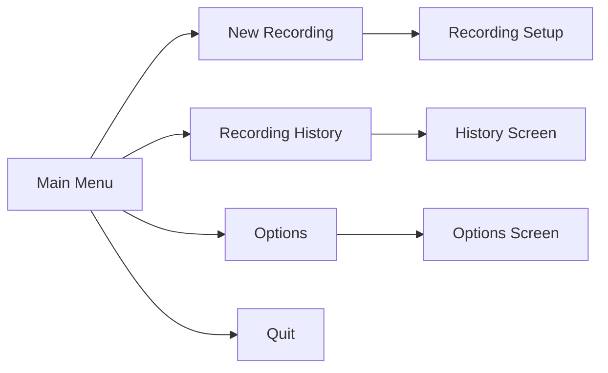

# Main Menu

The Main Menu is the starting point of Kartoza Video Processor. From here, you can access all major features of the application.

## Screen Preview

Kartoza Video Processor - Main Menu

━━━━━━━━━━━━━━━━━━━━━━━━━━━━━━━━━━━━━━━━━━━━━━━━━
                    Main Menu
━━━━━━━━━━━━━━━━━━━━━━━━━━━━━━━━━━━━━━━━━━━━━━━━━

  → New Recording
    Recording History        (42 recordings)
    Options
    Quit

━━━━━━━━━━━━━━━━━━━━━━━━━━━━━━━━━━━━━━━━━━━━━━━━━
↑/k: up • ↓/j: down • enter/space: select • q: quit

## Menu Items

### New Recording

 **New Recording**

Opens the [Recording Setup](recording-setup.md) screen where you can configure and start a new screen recording.

**What you can do:**

- Set recording title and episode number
- Choose recording options (audio, webcam, logos)
- Select which monitor to record
- Configure vertical video output

---

### Recording History

 **Recording History** *(with count)*

Opens the [History](history.md) screen showing all your past recordings. The count in parentheses shows how many recordings are available.

**What you can do:**

- Browse all past recordings
- View recording metadata
- Open recording folder
- Delete old recordings
- Upload recordings to YouTube

---

### Options

 **Options**

Opens the [Options](options.md) screen for application configuration.

**What you can configure:**

- Topic management (add/remove topics)
- Default presenter name
- Logo directory location
- YouTube API credentials

---

### Quit

 **Quit**

Exits the application. You can also press ++q++ at any time from this menu.

## Keyboard Shortcuts

| Key | Action |
|-----|--------|
| ++up++ / ++k++ | Move selection up |
| ++down++ / ++j++ | Move selection down |
| ++enter++ / ++space++ | Select highlighted item |
| ++q++ / ++ctrl+c++ | Quit application |

## Navigation Flow

## External Recording Detection

!!! warning "External Recording Warning"
    If the application detects an existing screen recording process (such as from OBS or another instance), a warning will be displayed at the top of the menu. You should stop the external recording before starting a new one.

Warning Example

⚠ Warning: External recording detected (PID: 12345)
  Stop the external recording before starting a new one.

                    Main Menu
...

## Next Steps

From the Main Menu, you'll typically want to:

1. **[Start a new recording](recording-setup.md)** - Configure and begin recording
2. **[Review past recordings](history.md)** - Browse your recording library
3. **[Configure options](options.md)** - Set up topics and preferences
