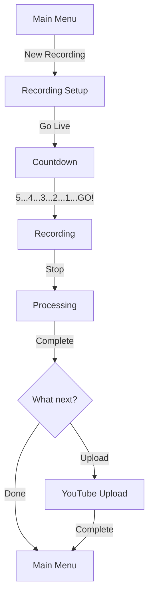

# Recording a Video

This workflow guide walks you through the complete process of creating a screen recording from start to finish.

## Workflow Overview



## Step-by-Step Guide

<div class="workflow-step">
<div class="workflow-step-number">1</div>
<div>
<strong>Start from Main Menu</strong><br>
Launch the application and select <strong>New Recording</strong> from the <a href="../screens/main-menu.md">Main Menu</a>.
</div>
</div>

---

### Configure Your Recording

<div class="workflow-step">
<div class="workflow-step-number">2</div>
<div>
<strong>Set Recording Title</strong><br>
Enter a descriptive title for your video. This becomes the filename and YouTube title.
</div>
</div>

<div class="workflow-step">
<div class="workflow-step-number">3</div>
<div>
<strong>Select Topic</strong><br>
Choose a topic category. Use <kbd>←</kbd>/<kbd>→</kbd> to cycle through options.
</div>
</div>

<div class="workflow-step">
<div class="workflow-step-number">4</div>
<div>
<strong>Configure Recording Options</strong><br>
Toggle the features you need:
<ul>
<li><strong>Record Audio</strong> - Capture microphone</li>
<li><strong>Record Webcam</strong> - Add picture-in-picture</li>
<li><strong>Record Screen</strong> - Capture monitor</li>
<li><strong>Vertical Video</strong> - Create 9:16 version</li>
<li><strong>Add Logos</strong> - Professional branding</li>
</ul>
</div>
</div>

<div class="workflow-step">
<div class="workflow-step-number">5</div>
<div>
<strong>Select Monitor</strong><br>
Choose which monitor to record if you have multiple displays.
</div>
</div>

<div class="workflow-step">
<div class="workflow-step-number">6</div>
<div>
<strong>Press Go Live</strong><br>
Navigate to the <strong>Go Live</strong> button and press <kbd>Enter</kbd>.
</div>
</div>

---

### The Countdown

<div class="workflow-step">
<div class="workflow-step-number">7</div>
<div>
<strong>Prepare During Countdown</strong><br>
A 5-second countdown with audio beeps gives you time to:
<ul>
<li>Position your mouse</li>
<li>Clear your throat</li>
<li>Take a breath</li>
<li>Focus on your content</li>
</ul>
</div>
</div>

!!! tip "Cancelling the Countdown"
    Press ++esc++ at any time to cancel and return to setup with your settings preserved.

---

### During Recording

<div class="workflow-step">
<div class="workflow-step-number">8</div>
<div>
<strong>Record Your Content</strong><br>
The recording screen shows:
<ul>
<li>Blinking <span class="t-red">● REC</span> indicator</li>
<li>Elapsed time counter</li>
<li>Pause and Stop buttons</li>
</ul>
</div>
</div>

**Recording Controls:**

| Key | Action |
|-----|--------|
| ++p++ | Pause/Resume recording |
| ++s++ | Stop recording |

<div class="workflow-step">
<div class="workflow-step-number">9</div>
<div>
<strong>Pause if Needed</strong><br>
Press <kbd>p</kbd> to pause for breaks. The timer freezes and you can resume seamlessly.
</div>
</div>

<div class="workflow-step">
<div class="workflow-step-number">10</div>
<div>
<strong>Stop When Finished</strong><br>
Press <kbd>s</kbd> or select <strong>Stop</strong> to end the recording.
</div>
</div>

---

### Post-Processing

<div class="workflow-step">
<div class="workflow-step-number">11</div>
<div>
<strong>Automatic Processing</strong><br>
The application automatically:
<ol>
<li>Finalizes raw recordings</li>
<li>Normalizes audio levels</li>
<li>Merges video and audio</li>
<li>Adds logo overlays (if enabled)</li>
<li>Creates vertical version (if enabled)</li>
<li>Saves metadata</li>
</ol>
</div>
</div>

---

### After Processing

<div class="workflow-step">
<div class="workflow-step-number">12</div>
<div>
<strong>Choose Next Action</strong><br>
<ul>
<li><strong>Upload to YouTube</strong> - Continue to <a href="youtube-workflow.md">YouTube workflow</a></li>
<li><strong>Return to Menu</strong> - Save for later</li>
</ul>
</div>
</div>

## Output Files

Your recording is saved to:

```
~/Videos/Screencasts/<topic>/<title>/
├── final.mp4           # Processed video
├── final_vertical.mp4  # Vertical version (if enabled)
├── metadata.json       # Recording information
├── video.mkv           # Raw screen capture
├── audio.wav           # Raw audio
└── webcam.mkv          # Raw webcam (if enabled)
```

## Quick Reference

### Minimum Recording Setup

For a basic screen recording:

1. Set title
2. Ensure "Record Screen" is enabled
3. Select monitor
4. Press "Go Live"

### Full-Featured Recording

For professional videos:

1. Set title and episode number
2. Select appropriate topic
3. Enable audio, screen, and logos
4. Configure logo positions
5. Select monitor
6. Add description
7. Press "Go Live"

## Troubleshooting

### No Audio Captured

- Check microphone is connected
- Verify audio system (PipeWire/PulseAudio) is running
- Test with `arecord -l` to list devices

### Black Screen Recording

- Ensure correct monitor is selected
- Check FFmpeg can access display
- On Wayland, ensure screen sharing permissions

### Recording Stutters

- Close unnecessary applications
- Reduce recording resolution
- Disable webcam if not needed

## Related Pages

- **[Recording Setup](../screens/recording-setup.md)** - Detailed field reference
- **[Countdown](../screens/countdown.md)** - Countdown details
- **[Recording](../screens/recording.md)** - Recording screen controls
- **[Processing](../screens/processing.md)** - Processing steps
- **[YouTube Workflow](youtube-workflow.md)** - Upload after recording
