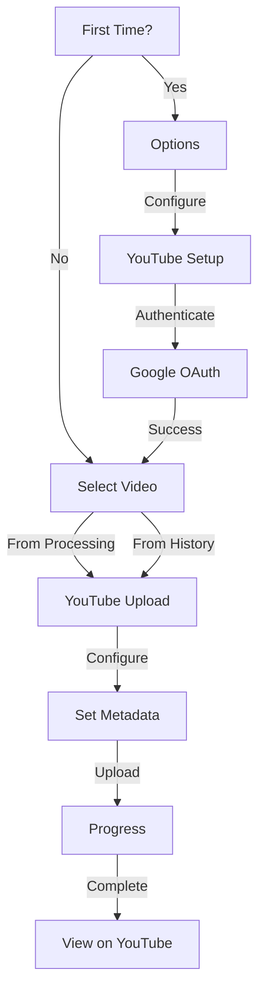

# Uploading to YouTube

This workflow guide covers the complete process of uploading your recordings to YouTube, from initial setup to published video.

## Workflow Overview



## First-Time Setup

If you haven't connected YouTube yet, you'll need to set up API credentials first.

<div class="workflow-step">
<div class="workflow-step-number">1</div>
<div>
<strong>Create Google Cloud Project</strong><br>
<ol>
<li>Go to <a href="https://console.cloud.google.com/">Google Cloud Console</a></li>
<li>Create a new project or select existing</li>
<li>Enable <strong>YouTube Data API v3</strong></li>
</ol>
</div>
</div>

<div class="workflow-step">
<div class="workflow-step-number">2</div>
<div>
<strong>Create OAuth Credentials</strong><br>
<ol>
<li>Go to <strong>APIs & Services</strong> → <strong>Credentials</strong></li>
<li>Click <strong>Create Credentials</strong> → <strong>OAuth 2.0 Client ID</strong></li>
<li>Select <strong>Desktop Application</strong></li>
<li>Copy the <strong>Client ID</strong> and <strong>Client Secret</strong></li>
</ol>
</div>
</div>

<div class="workflow-step">
<div class="workflow-step-number">3</div>
<div>
<strong>Configure in Application</strong><br>
<ol>
<li>Open <strong>Main Menu</strong> → <strong>Options</strong></li>
<li>Select <strong>Configure YouTube</strong></li>
<li>Enter your Client ID and Client Secret</li>
<li>Press <strong>Connect</strong></li>
</ol>
</div>
</div>

<div class="workflow-step">
<div class="workflow-step-number">4</div>
<div>
<strong>Authenticate with Google</strong><br>
<ol>
<li>A browser window opens automatically</li>
<li>Sign in to your Google account</li>
<li>Grant permissions to the application</li>
<li>Return to the terminal</li>
</ol>
</div>
</div>

!!! success "Setup Complete"
    Once authenticated, you won't need to repeat this process unless you disconnect or revoke access.

---

## Uploading a Video

### From Processing Screen

After completing a recording:

<div class="workflow-step">
<div class="workflow-step-number">5</div>
<div>
<strong>Select Upload to YouTube</strong><br>
When processing completes, choose <strong>Upload to YouTube</strong> from the options.
</div>
</div>

### From Recording History

For existing recordings:

<div class="workflow-step">
<div class="workflow-step-number">5</div>
<div>
<strong>Open History and Select Recording</strong><br>
<ol>
<li>Go to <strong>Main Menu</strong> → <strong>Recording History</strong></li>
<li>Navigate to the recording you want to upload</li>
<li>Press <kbd>u</kbd> to upload</li>
</ol>
</div>
</div>

---

### Configure Upload

<div class="workflow-step">
<div class="workflow-step-number">6</div>
<div>
<strong>Review and Edit Title</strong><br>
The title is pre-filled from your recording. Edit if needed.
<br><br>
<em>Tip: Include keywords for better discoverability.</em>
</div>
</div>

<div class="workflow-step">
<div class="workflow-step-number">7</div>
<div>
<strong>Edit Description</strong><br>
Add or modify the video description. Include:
<ul>
<li>Brief summary of content</li>
<li>Timestamps for sections</li>
<li>Links to resources</li>
<li>Call to action</li>
</ul>
</div>
</div>

<div class="workflow-step">
<div class="workflow-step-number">8</div>
<div>
<strong>Set Privacy Level</strong><br>
Choose visibility:
<table>
<tr><td><strong>Public</strong></td><td>Anyone can find and watch</td></tr>
<tr><td><strong>Unlisted</strong></td><td>Only via direct link (recommended for review)</td></tr>
<tr><td><strong>Private</strong></td><td>Only you can watch</td></tr>
</table>
</div>
</div>

<div class="workflow-step">
<div class="workflow-step-number">9</div>
<div>
<strong>Select Playlist</strong><br>
Optionally add the video to a playlist for organization.
</div>
</div>

---

### Upload Process

<div class="workflow-step">
<div class="workflow-step-number">10</div>
<div>
<strong>Start Upload</strong><br>
Press <strong>Upload</strong> to begin. The progress screen shows:
<ul>
<li>Upload percentage</li>
<li>Bytes transferred</li>
<li>Current speed</li>
<li>Estimated time remaining</li>
</ul>
</div>
</div>

!!! warning "Don't Close"
    Keep the application open during upload. Closing will cancel the upload.

<div class="workflow-step">
<div class="workflow-step-number">11</div>
<div>
<strong>Wait for Completion</strong><br>
Upload time depends on:
<ul>
<li>File size</li>
<li>Internet connection speed</li>
<li>YouTube server load</li>
</ul>
</div>
</div>

---

### After Upload

<div class="workflow-step">
<div class="workflow-step-number">12</div>
<div>
<strong>View Your Video</strong><br>
<ul>
<li>Copy the video URL provided</li>
<li>Select <strong>Open in Browser</strong> to view immediately</li>
<li>Or press <strong>Done</strong> to return to the application</li>
</ul>
</div>
</div>

!!! note "Processing Time"
    YouTube may take additional time to process your video after upload. Higher resolutions (1080p, 4K) take longer to become available.

## Managing Playlists

### Creating a New Playlist

<div class="workflow-step">
<div class="workflow-step-number">1</div>
<div>
<strong>Open YouTube Setup</strong><br>
Go to <strong>Options</strong> → <strong>Configure YouTube</strong>
</div>
</div>

<div class="workflow-step">
<div class="workflow-step-number">2</div>
<div>
<strong>Create Playlist</strong><br>
<ol>
<li>Scroll to the Playlists section</li>
<li>Select <strong>Create Playlist</strong></li>
<li>Enter title and description</li>
<li>Set privacy level</li>
<li>Press <strong>Create</strong></li>
</ol>
</div>
</div>

### Setting Default Playlist

In [YouTube Setup](../screens/youtube-setup.md), you can set a default playlist that's automatically selected for new uploads.

## Best Practices

### Video Titles

| Do | Don't |
|-----|-------|
| Be descriptive and specific | Use clickbait |
| Include keywords naturally | Stuff keywords |
| Keep under 60 characters | Write novels |

### Descriptions

```markdown
In this video, I'll show you how to [main topic].

Timestamps:
0:00 Introduction
1:30 Setting up
3:45 Main demonstration
8:20 Tips and tricks
10:00 Conclusion

Resources:
- Link to project: https://...
- Documentation: https://...

Subscribe for more tutorials!
```

### Privacy Strategy

1. **Upload as Unlisted** first
2. Review on YouTube for issues
3. Add thumbnail, cards, end screens
4. Change to **Public** when ready

## Troubleshooting

### Authentication Expired

**Symptom:** "Auth expired" error when trying to upload

**Solution:**
1. Go to Options → Configure YouTube
2. Select "Disconnect"
3. Reconnect and re-authenticate

### Upload Stuck at 0%

**Symptom:** Progress bar doesn't move

**Possible causes:**
- Firewall blocking connection
- Network issues
- YouTube API quota exceeded

**Solution:**
1. Check internet connection
2. Try again later
3. Check Google Cloud Console for quota status

### Video Processing Failed on YouTube

**Symptom:** Upload succeeds but video shows error on YouTube

**Possible causes:**
- Corrupt video file
- Unsupported codec

**Solution:**
1. Re-export video with standard settings
2. Use H.264 codec, AAC audio
3. Try re-uploading

## Quick Reference

### Keyboard Shortcuts (Upload Screen)

| Key | Action |
|-----|--------|
| ++tab++ | Next field |
| ++shift+tab++ | Previous field |
| ++left++ / ++right++ | Change selection |
| ++enter++ | Upload |
| ++esc++ | Cancel |

### Upload Requirements

| Requirement | Specification |
|-------------|---------------|
| **Format** | MP4 (H.264/AAC) |
| **Max Size** | 256 GB |
| **Max Duration** | 12 hours |
| **Resolution** | Up to 8K |

## Related Pages

- **[YouTube Setup](../screens/youtube-setup.md)** - Configure credentials
- **[YouTube Upload](../screens/youtube-upload.md)** - Upload screen details
- **[Recording Workflow](recording-workflow.md)** - Create recordings first
- **[History](../screens/history.md)** - Upload past recordings
